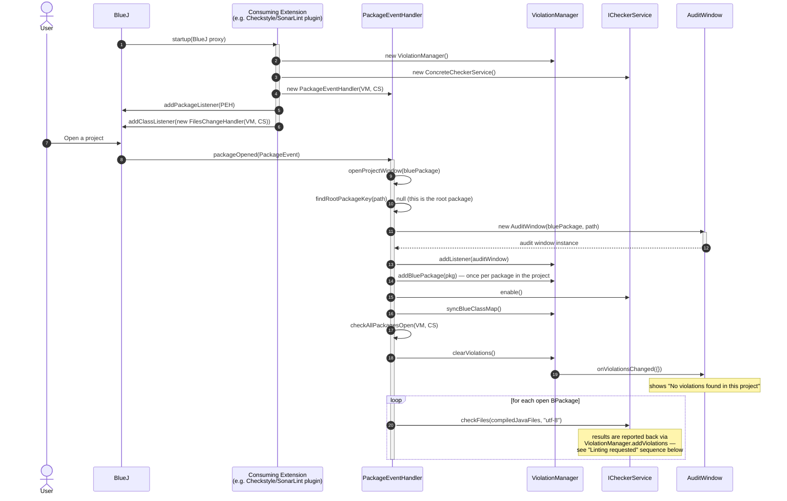
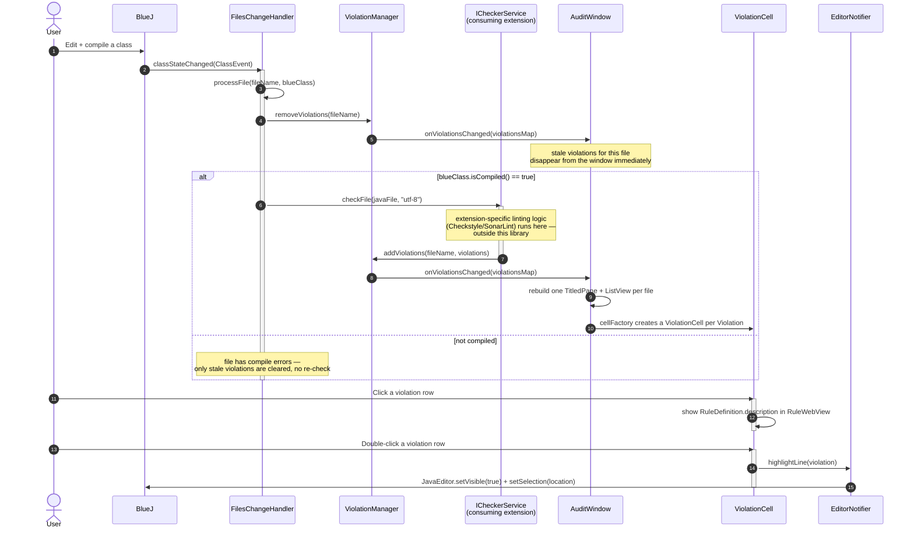

# System Documentation

This document describes the structure of `bluej-linting-core` and how it integrates with BlueJ at
runtime. It complements [`CLAUDE.md`](../CLAUDE.md), which covers build/CI details; this file focuses
on the class structure and the two runtime sequences that matter most for anyone extending this
library: **startup** and **handling a lint request**.

> Note on scope: this library provides the plumbing (violation storage, BlueJ event handlers, the
> audit window UI). It does not itself run Checkstyle/SonarLint or any other linter — that's supplied
> by the consuming extension via `ICheckerService`. Diagrams below mark that boundary explicitly.

## Class diagram

```mermaid
classDiagram
    direction LR

    %% === BlueJ Extension API (external, not part of this library) ===
    class BPackage { <<BlueJ API>> }
    class BClass { <<BlueJ API>> }
    class PackageListener { <<BlueJ API interface>> }
    class ClassListener { <<BlueJ API interface>> }
    class JavaEditor { <<BlueJ API>> }

    %% === checker ===
    class ICheckerService {
        <<interface>>
        +enable()
        +disable()
        +isEnabled() boolean
        +checkFile(File, String)
        +checkFiles(List~File~, String)
    }

    %% === violations ===
    class Violation {
        -summary String
        -blueClass BClass
        -location TextLocation
        -ruleDefinition RuleDefinition
        +getSummary() String
        +getBClass() BClass
        +getFile() File
        +getLocation() TextLocation
        +getRuleDefinition() RuleDefinition
    }

    class RuleDefinition {
        -title String
        -ruleId String
        -description String
        -severity String
        -type String
        -iconMapper IconMapper$
        +setIconMapper(IconMapper)$
        +getTitle() String
        +getRuleId() String
        +getDescription() String
        +getSeverityIcon() URL
        +getTypeIcon() URL
    }

    class ViolationListener {
        <<interface>>
        +onViolationsChanged(Map~String,List~Violation~~)
    }

    class ViolationManager {
        -listeners List~ViolationListener~
        -violations Map~String,List~Violation~~
        -bluePackages List~BPackage~
        -blueClassMap Map~String,BClass~
        +addViolations(String, List~Violation~)
        +setViolations(String, List~Violation~)
        +getViolations(String) List~Violation~
        +removeViolations(String)
        +clearViolations()
        +addListener(ViolationListener)
        +removeListener(ViolationListener)
        +addBluePackage(BPackage)
        +removeBluePackage(BPackage)
        +getBluePackages() List~BPackage~
        +syncBlueClassMap()
        +getBlueClass(String) BClass
    }

    %% === handlers ===
    class PackageEventHandler {
        -projectWindowMap Map~String,AuditWindow~
        -violationManager ViolationManager
        -checkerService ICheckerService
        +packageOpened(PackageEvent)
        +packageClosing(PackageEvent)
        +openProjectWindow(BPackage)
        +showProjectWindow(BPackage)
        +checkAllPackagesOpen(ViolationManager, ICheckerService)$
    }

    class FilesChangeHandler {
        -violationManager ViolationManager
        -checkerService ICheckerService
        +classStateChanged(ClassEvent)
        +classNameChanged(ClassEvent)
        +classRemoved(ClassEvent)
    }

    %% === ui ===
    class AuditWindow {
        -vbox VBox
        -projectDirectory String
        -ruleWebView RuleWebView
        -statusBar HBox$
        -titlePrefix String$
        +onViolationsChanged(Map~String,List~Violation~~)
        +setStatusBar(HBox)$
        +setTitlePrefix(String)$
    }

    class ViolationCell {
        -violation Violation
        -ruleWebView RuleWebView
        +updateItem(Violation, boolean)
    }

    class RuleWebView {
        -webView WebView
        -content String
        -stylesheet String$
        +setContent(String)
        +getWebView() WebView
        +getWebEngine() WebEngine
        +setStylesheet(String)$
    }

    class ErrorDialog {
        +ErrorDialog(String, String, String)
    }

    %% === editor ===
    class EditorNotifier {
        <<utility>>
        +highlightLine(Violation)$
    }

    %% === util ===
    class IconMapper {
        <<interface>>
        +getIcon(String) URL
    }

    PackageListener <|.. PackageEventHandler
    ClassListener <|.. FilesChangeHandler
    ViolationListener <|.. AuditWindow

    PackageEventHandler --> ViolationManager
    PackageEventHandler --> ICheckerService
    PackageEventHandler --> AuditWindow : creates/manages one per root project

    FilesChangeHandler --> ViolationManager
    FilesChangeHandler --> ICheckerService

    ViolationManager o--> ViolationListener : notifies
    ViolationManager o--> Violation : stores, keyed by file path
    ViolationManager --> BPackage
    ViolationManager --> BClass

    AuditWindow *--> RuleWebView
    AuditWindow ..> ViolationCell : cellFactory
    ViolationCell --> RuleWebView
    ViolationCell --> Violation
    ViolationCell ..> EditorNotifier : on double-click

    Violation --> RuleDefinition
    Violation --> BClass
    RuleDefinition --> IconMapper : icon lookup (static, injected)

    EditorNotifier ..> Violation
    EditorNotifier ..> JavaEditor
```

Notes on reading this diagram:

- `ICheckerService` and `IconMapper` are the only two interfaces this library expects a **consuming
  extension** to implement. Everything else is used as-is.
- `RuleDefinition.iconMapper` and `AuditWindow.statusBar`/`titlePrefix` are `static` (marked `$`),
  meaning they're shared/injected once per JVM, not per instance — see `RuleDefinition.setIconMapper`,
  `AuditWindow.setStatusBar`, `AuditWindow.setTitlePrefix`.
- `PackageEventHandler` keeps at most one `AuditWindow` per **root** BlueJ project; sub-packages of an
  already-open root register with the existing `ViolationManager` instead of getting their own window
  (see `findRootPackageKey`).

## Sequence: startup from BlueJ

This covers extension registration and what happens the moment a user opens a project in BlueJ.

Key points:

- The **consuming extension** (not this library) is responsible for calling `startup()`'s registration
  steps — constructing the `ViolationManager`/`ICheckerService`/`PackageEventHandler`, and registering
  `PackageEventHandler` and a `FilesChangeHandler` with BlueJ as `PackageListener`/`ClassListener`.
- Opening a **sub-package** of an already-open root project takes a different, cheaper path: no new
  `AuditWindow` is created — `PackageEventHandler` just calls `violationManager.addBluePackage(...)` and
  still triggers `checkAllPackagesOpen`.
- `checkFiles` is only called for classes that report `isCompiled() == true`; uncompiled files are
  silently skipped.

## Sequence: linting requested from BlueJ

This covers the common case — a user edits and successfully compiles a class in BlueJ — plus the
resulting UI interaction of jumping to a violation in the editor.

Key points:

- `ViolationManager.addViolations(...)` is **not called by this library** — it's the contract the
  consuming extension's `ICheckerService.checkFile`/`checkFiles` implementation is expected to fulfil
  once it has finished linting and built its `List<Violation>`. This library only defines the trigger
  (`checkFile`) and the sink (`addViolations`); it doesn't wire the two together itself.
- Removing violations happens *before* the (re-)check, so the UI never shows stale results while a
  check is in flight — it briefly shows zero violations for that file, then the fresh set once
  `addViolations` fires.
- `FilesChangeHandler.classNameChanged` and `classRemoved` follow the same
  `removeViolations`/`checkFile` shape as `classStateChanged`, just keyed off the old file name.
- The same `AuditWindow.onViolationsChanged` → rebuild path is what also drives the bulk
  `checkAllPackagesOpen` flow from the startup sequence.
